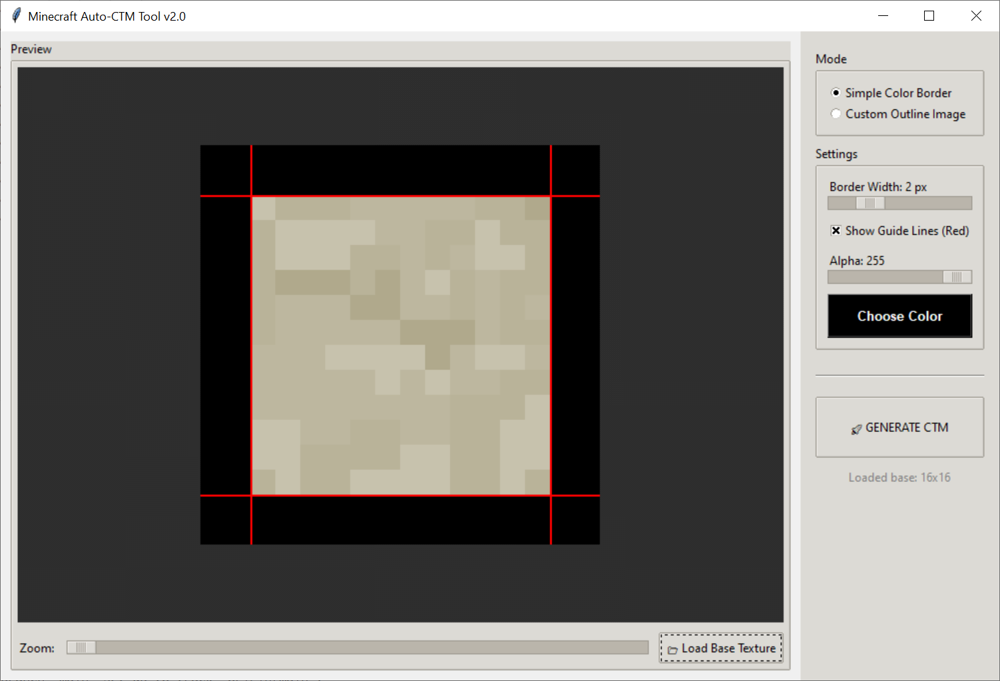

# Minecraft Connected Textures Generator (CTM)


A modern, robust utility for Minecraft resource pack artists. This tool automates the tedious process of creating **Connected Textures (CTM)** for OptiFine or NeoForge/Fabric (Fusion/Continuity). 

It turns a single block texture into the **47 unique tiles** required for seamless glass, bookshelves, and decorative blocks.

> **Note:** This is a complete rewrite and modernization of the [Auto-CTM](https://github.com/22or/Auto-CTM) tool. It features a new GUI, real-time preview, zoom capabilities, and stable architecture.

---

## 📸 Preview



---

## ✨ Features

*   **⚡ Instant Generation:** Automatically slices and assembles all 47 standard CTM tiles (0-46.png) from a single source image.
*   **👁️ Real-Time Preview:**
    *   See exactly how your texture will look before saving.
    *   **Zoom Control:** Inspect pixel-perfect details.
    *   **Visual Guides:** Optional red overlay lines show exactly where the borders are cut.
*   **🎨 Dual Modes:**
    *   **Simple Border:** Generate a procedural colored border with adjustable **Width** and **Alpha** (transparency). Perfect for clear glass.
    *   **Custom Outline:** Upload your own hand-drawn border texture. The tool handles the complex slicing logic for you.
*   **📄 Auto-Configuration:** Automatically generates the required `.properties` file for OptiFine.
*   **🛠 Modern UI:** Clean, dark-themed interface built with stability in mind (no more crashes or freezing).

---

## 🚀 Installation & Usage

### Prerequisites
*   [Python 3.8+](https://www.python.org/downloads/)
*   The `Pillow` library

### Running from Source

1.  **Clone the repository:**
    ```bash
    git clone https://github.com/Rostezkiy/Minecraft-Connected-Textures-Generator-CTM-.git
    cd Minecraft-CTM-Generator
    ```

2.  **Install dependencies:**
    ```bash
    pip install Pillow
    ```

3.  **Run the application:**
    ```bash
    python main.py
    ```

---

## 📖 How to Use

1.  **Load Base Texture:** 
    Click `📂 Load Base Texture` and select your block texture (must be PNG, typically 16x16, 32x32, etc.).

2.  **Choose Your Mode:**
    *   **Simple Color Border:** Use the color picker and sliders to generate a procedural border. Great for simple tinted glass.
    *   **Custom Outline Image:** If you have a specific frame design (e.g., gold trim), upload an image that contains **only the frame** (transparent center).

3.  **Adjust Settings:**
    *   Set the **Border Width** slider. 
    *   *Tip:* Enable **"Show Guide Lines"** to ensure the red lines match your border's thickness exactly.

4.  **Generate:**
    *   Click `🚀 GENERATE CTM`.
    *   Select an output folder.
    *   The tool will create a subfolder with your texture name containing all 47 images and the properties file.

5.  **Install in Minecraft:**
    Move the generated folder to your resource pack:
    `assets/minecraft/optifine/ctm/my_texture_folder/`

---

## 🤝 Credits & Attribution

This project is a **complete rewrite** inspired by the original idea from:
*   **[Auto-CTM](https://github.com/22or/Auto-CTM) by 22or**

While the core concept (the logic of how CTM tiles are indexed) remains the same, the codebase has been entirely reconstructed to support Object-Oriented Programming (OOP), modern UI frameworks, and enhanced user experience features like zooming and custom outlines.

---

## 📄 License

This project is licensed under the **MIT License**. Feel free to fork, modify, and distribute.
See [LICENSE](LICENSE) for more details.